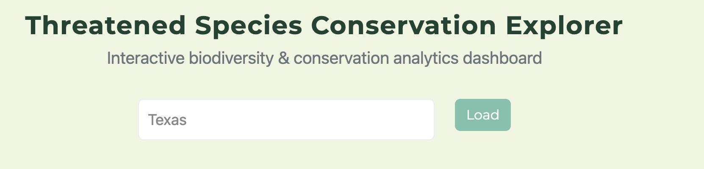
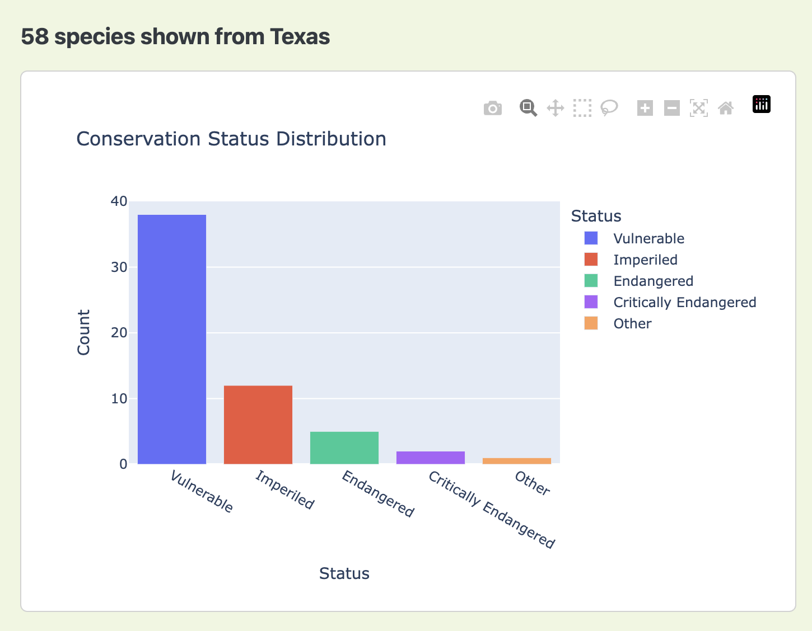
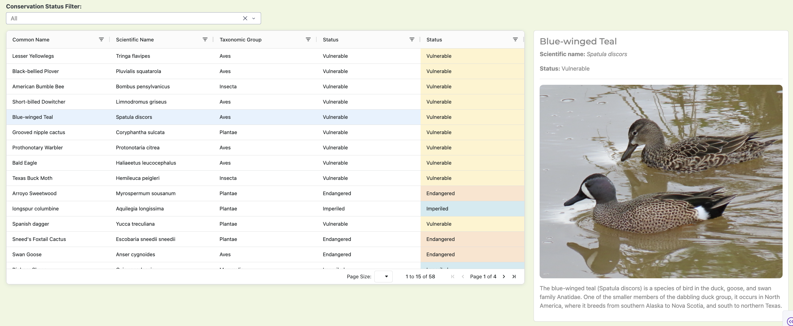

# Species Conservation Status Tool

The Species Conservation tool uses data from the iNaturalist API to bring awareness to species with conservation concerns in specified geographic regions. Given a location, this tool retrieves information on different species and their conservation status from the iNaturalist API. The species included are classified as threatened, vulnerable, or endangered based on systems like NatureServe and the IUCN. The goal of the project is to make it easier to discover species of conservation interest that have been observed in a particular area using publicly available and citizen collected biodiversity data. Available as a containerized tool, this repository contains everything needed to launch and interact with the conservation tool dashboard. 



## Features
- Search species by location (e.g., state or region)
    - Location must follow specific format:
        - City, State (ex: Austin, Texas)
        - Country (ex: Canada)
        - Region/Province (ex: Chihuahua)
- Interactive dashboards:
    - Conservation status distribution (bar chart)
    - Taxonomic group breakdown (pie chart)
- Filterable species table with pagination
- Clickable species rows for detailed information
- Species detail panel with:
    - Wikipedia summary
    - Image (when available)
- Redis-backed caching for faster repeated queries
- Fully containerized with Docker and Docker Compose
[^1]




## Project file Structure
```.
├── app.py                     # Dash frontend application
├── conservation_status.py     # Data retrieval and caching logic
├── requirements.txt           # Python dependencies
├── Dockerfile                 # App container definition
├── docker-compose.yml         # Multi-container setup (app + Redis)
└── README.me
```

## Services
The app runs two services:
- Dash App
    - Built with Plotly
    - Runs on port `8050`
- Redis Cache
    - Stores API responses and species data
    - Improves performance on repeated searches
    - Runs internally via `redis-db`
[^1]

## Using the dashboard

### Prerequisites
- Users must have Docker version 28.2.2 or later and Python 3.12 or later
- Ensure this repository is cloned:
    - ```https://github.com/avallejo100/species-conservation-status-tool.git```

### Building and Runnning (Docker)
Build and run the container using the following command:
    - `docker-compose up --build`

One the app is running, open the following on a web brows:
    - `http://localhost:8050`

### Running locally
If running outside of Docker:
- Install required packages:
    - `pip install -r requirements.txt`
- Make sure redis is running on `localhost:6379`
- Run app from terminal/shell:
    - `python app.py`

## How it works
- User enters a location
- `conservation_status.py` retrieves species data:
    - Calls external APIs
    - Uses Redis cache when available
- Data is processed into a Pandas dataframe
- Dash renders:
    - Charts (Plotly)
    - Interactive table (dash-ag-grid)
    - Detail panel (Wikipedia summary lookup)
- Filters update the displayed dataset dynamically



## AI Usage
AI was not used in any portion of the code of this project. AI was used partially in this README only where noted.
[^1]: AI Usage